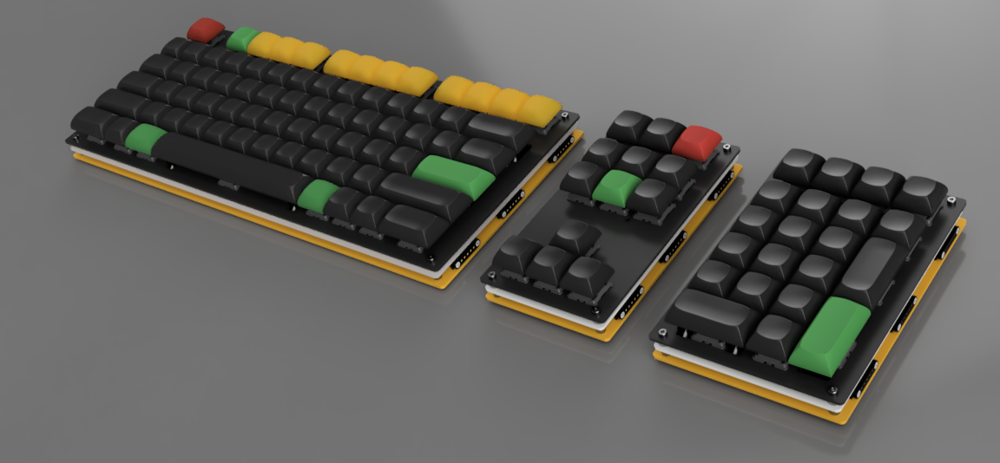

# OmniCode:9001
A modular keyboard made up of three detachable untis.

*POGO pins are rendered with 5 pins only*

## Overview
OmniCode:9001 is the ultimate evolution of modular keyboards—born in Hong Kong, engineered for control beyond limits. This highly customizable, open-source keyboard is designed for ergonomic comfort, maximum flexibility, and creative power. With magnetic, hot-swappable blocks like GlyphMatrix, PhaseShift, and DeltaForm, OmniCode:9001 adapts to every workflow—from deep code to macro magic. Sleek, stylish, and laced with anime-level energy, it's more than a keyboard—it’s a power interface for those who type like they're piloting a mecha.

Inspired by the best features of split and compact layouts, OmniCode:9001 is suitable for both daily typing and advanced programming. The design supports a wide range of switch types, keycap profiles, and is built around the RP2040 microcontroller for next-generation performance. Ideal for makers and keyboard enthusiasts who demand the best.

## Sub Modules
- **Alpha Block:** GlyphMatrix taps into the visual power of language—glyphs as symbols, matrix as command stream. It’s the scriptwriter for your digital world.

- **Nav Block:** PhaseShift suggests rapid movement, shifting through modes or layers like teleportation. It’s your tactical array for traversing digital dimensions.

- **Num Block:** DeltaForm Already perfect. This name suggests modular transformation. Zoom, macros, data entry—all reborn in a shapeshifting format.

## Builds
* [BOM](bom/README.md)