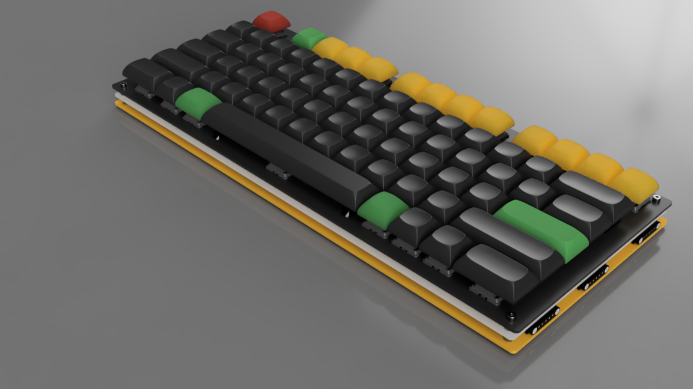

# GlyphMatrix (Alpha Block) BOM

GlyphMatrix taps into the visual power of language—glyphs as symbols, matrix as command stream. It’s the scriptwriter for your digital world.

*POGO pins are rendered with 5 pins only*

## Bill of Materials

### RP2040

| Parts            | Package     | Designator(s)                                                                                                         | Quantity |
|------------------|-------------|-----------------------------------------------------------------------------------------------------------------------|----------|
| RP2040           | QFN-56      | MCU1                                                                                                                  | 1        |
| W25Q128JVS       | SOIC-8      | U1                                                                                                                    | 1        |
| XC6206PxxxMR     | SOT-23      | U3                                                                                                                    | 1        |
| 1k               | 0402        | R1, R6, R8                                                                                                            | 3        |
| 27R              | 0603        | R4, R5                                                                                                                | 2        |
| 100nF            | 0402        | C1, C10, C11, C12, C13, C14, C15, C5, C6, C9                                                                          | 10       |
| 1uF              | 0402        | C16, C17, C4, C8                                                                                                      | 4        |
| 10uF             | 0402        | C7                                                                                                                    | 1        |
| 22pF             | 0402        | C2, C3                                                                                                                | 2        |
| 12MHz            | 3225        | Y1                                                                                                                    | 1        |
| SW_Push          | SKQG        | SW1, SW2                                                                                                              | 2        |

### USB

| Parts            | Package               | Designator(s)                                                                                               | Quantity |
|------------------|-----------------------|-------------------------------------------------------------------------------------------------------------|----------|
| USB-C Receptacle | USB4520-03-0-A Rev. A | USB1                                                                                                        | 1        |
| USBLC6-2SC6      | SOT-23-6              | U2                                                                                                          | 1        |
| 5k1              | 0402                  | R2, R3                                                                                                      | 2        |
| 500mA            | 1206                  | F1                                                                                                          | 1        |

### Key Switches

| Parts            | Package     | Designator(s)                                                                                                         | Quantity |
|------------------|-------------|-----------------------------------------------------------------------------------------------------------------------|----------|
| 1N4148W          | SOD-123     | D1-D74                                                                                                                | 74       |
| Hotswap Socket   | MX          | S1-S74                                                                                                                | 74       |
| WHITE            | 0603        | LED1                                                                                                                  | 1        |
| GREEN            | 0603        | LED2                                                                                                                  | 1        |

### Optional

| Parts             | Package     | Designator(s)                                                                                                         | Quantity |
|-------------------|-------------|-----------------------------------------------------------------------------------------------------------------------|----------|
| SK6812MINI-E      | SK6812MINI-E| L1-L74                                                                                                                | 74       |
| POGO 5 pin-male   | Curved      | POGO1                                                                                                                 | 2        |
| POGO 5 pin-female | Curved      | POGO2                                                                                                                 | 2        |
| POGO 7 pin-male   | Curved      | POGO3, POGO5                                                                                                          | 2        |
| POGO 7 pin-female | Curved      | POGO4, POGO6                                                                                                          | 2        |

# Other blocks

* [PhaseShift](bom-phaseshift.md)
* [DeltaForm](bom-deltaform.md)