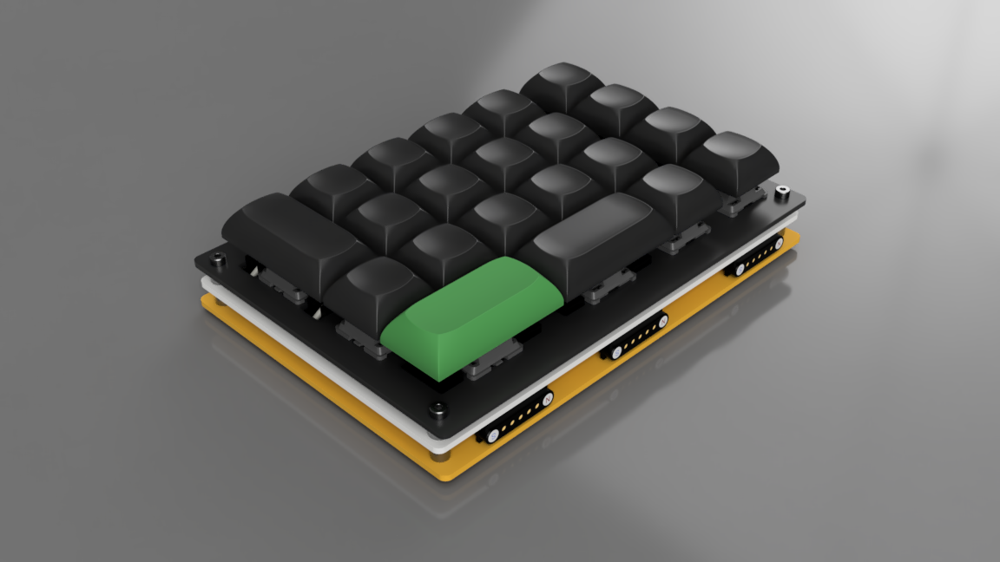

# DeltaForm (Num Block) BOM

DeltaForm Already perfect. This name suggests modular transformation. Zoom, macros, data entry—all reborn in a shapeshifting format.

*POGO pins are rendered with 5 pins only*

## Bill of Materials

| Parts             | Packeage    | Designator(s)                        | Quantity |
|-------------------|-------------|--------------------------------------|----------|
| Hotswap Socket    | MX          | S1-S21                               | 21       |
| 1N4148W           | SOD-123     | D1-D21                               | 21       |
| 330               | 0603        | R1                                   | 1        |
| GREEN             | 0603        | LED1                                 | 1        |
| POGO 5 pin-male   | Curved      | POGO1                                | 2        |
| POGO 5 pin-female | Curved      | POGO2                                | 2        |
| POGO 7 pin-male   | Curved      | POGO3, POGO5                         | 2        |
| POGO 7 pin-female | Curved      | POGO4, POGO6                         | 2        |

### Optional

| Parts          | Packeage    | Designator(s)                        | Quantity |
|----------------|-------------|--------------------------------------|----------|
| SK6812MINI-E   | SK6812MINI-E| L1-L21                               | 21       |