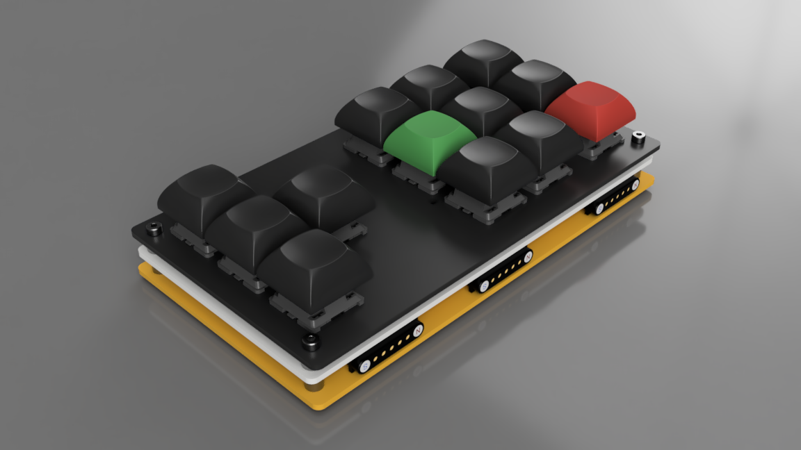

# PhaseShift (Nav Block) BOM

PhaseShift suggests rapid movement, shifting through modes or layers like teleportation. It’s your tactical array for traversing digital dimensions.

*POGO pins are rendered with 5 pins only*

## Bill of Materials

| Parts             | Packeage    | Designator(s)                        | Quantity |
|-------------------|-------------|--------------------------------------|----------|
| Hotswap Socket    | MX          | S1-S13                               | 13       |
| 1N4148W           | SOD-123     | D1-D13                               | 13       |
| 330               | 0603        | R1                                   | 1        |
| GREEN             | 0603        | LED1                                 | 1        |
| POGO 5 pin-male   | Curved      | POGO1                                | 2        |
| POGO 5 pin-female | Curved      | POGO2                                | 2        |
| POGO 7 pin-male   | Curved      | POGO3, POGO5                         | 2        |
| POGO 7 pin-female | Curved      | POGO4, POGO6                         | 2        |

### Optional

| Parts          | Packeage    | Designator(s)                        | Quantity |
|----------------|-------------|--------------------------------------|----------|
| SK6812MINI-E   | SK6812MINI-E| L1-L13                               | 13       |

# Other blocks

* [GlyphMatrix](README.md)
* [DeltaForm](bom-deltaform.md)