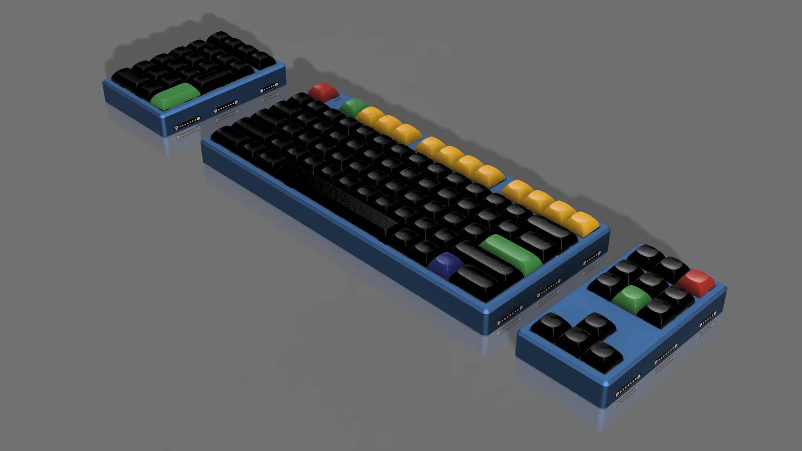

# OmniCode:9001 Case Files

This directory contains STEP files for all OmniCode:9001 cases. These files can be used for both 3D printing and CNC manufacturing.

## Case Components

### GlyphMatrix
- `GlyphMatrix_Top.step` - Top case
- `GlyphMatrix_PCB.step` - PCB model for reference

### PhaseShift
- `PhaseShift_Top.step` - Top case
- `PhaseShift_Plate.step` - Switch plate

### DeltaForm
- `DeltaForm_Top.step` - Top case
- `DeltaForm_Plate.step` - Switch plate

## Manufacturing Notes

### Screw Specifications
- All cases use M3 helicoils (thread inserts)
- Helicoil size: M3x0.5mm 1D(3mm)
- Required for both 3D printed and CNC manufactured cases

### 3D Printing Recommendations
- Material: Nylon or ABS recommended
- Layer Height: 0.2mm or less for better surface finish
- Infill: 60% minimum, recommanded over 80% 
- Wall Count: 4 minimum
- Support: Required for top cases
- Orientation: Print top cases upside down for best finish
- Note: Tap for helicoil installation after printing

### CNC Manufacturing
- Material: Aluminum 6061 recommended
- Finish: Can be anodized after manufacturing
- Thread spec: Tap for M3 helicoil installation

### Hardware Requirements
- M3 helicoils for all mounting points
- M3 screws for assembly: 8mm in length
- Follow the main build guide for assembly instructions

## Additional Notes
- All models are in 1:1 scale (millimeters)