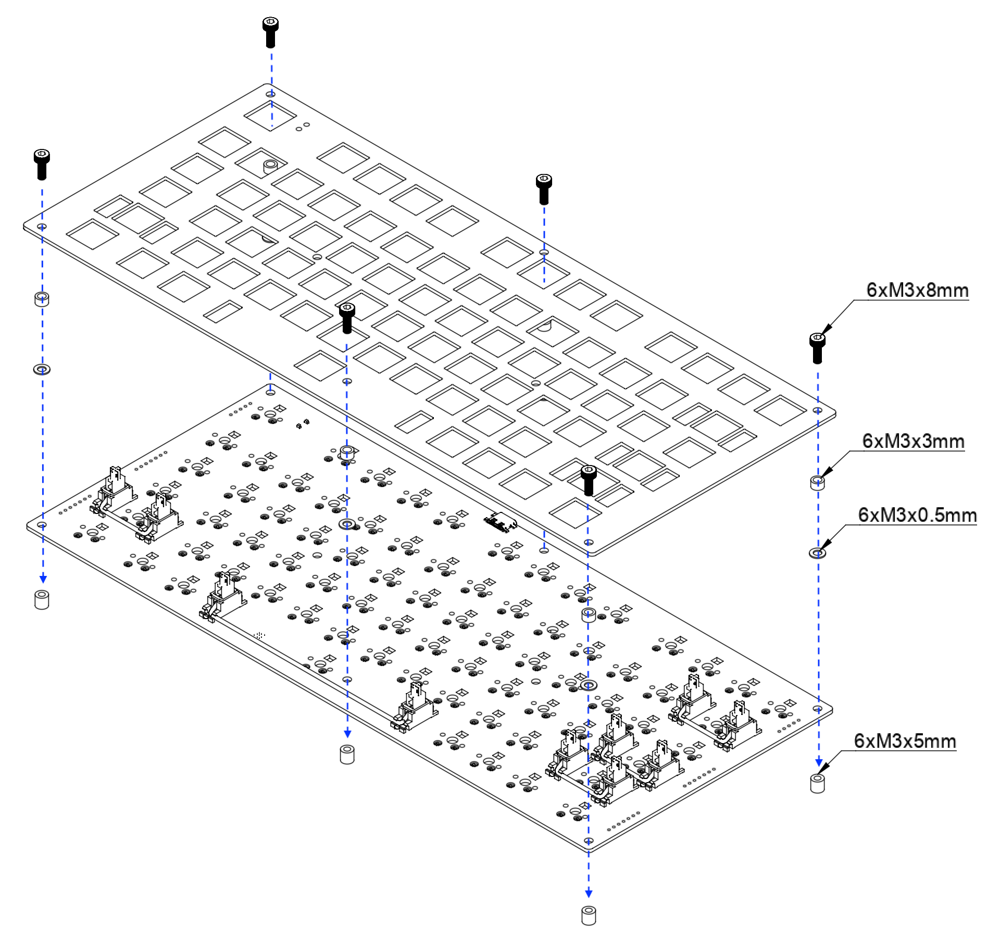

# Build Guide - GlyphMatrix

> **Note:** Even though using a pre-soldered PCB, it still requires manual soldering of hot swap sockets and LEDs.

## Parts
### Required
| Part                | Quantity | Notes                |
|---------------------|----------|----------------------|
| MX key switches     | 74       |                      |
| Hot swap sockets    | 74       |                      |
| Keycaps             | 74       |                      |
| M3x8 screws         | 6        |                      |
| Spacers (3mm)       | 6        |                      |
| M3 gaskets (0.5mm)  | 6        |                      |
| M3x4 screws         | 6        |                      |

### Optonal
| Part                | Quantity | Notes                |
|---------------------|----------|----------------------|
| RGB LEDs            | 74       | SK6812 mini-e        |

## Steps

1. **Soldering Hot Swap Sockets and LEDs**
   - **Hot Swap Sockets:** Solder all 74 hot swap sockets onto the PCB, making sure each socket is aligned with the footprint.
     
   - **Per-key LED (optional):** Solder per-key LEDs onto the PCB, making sure their orientation matches the footprint.
     
     

1. **Install Stabilizers**
     

1. **Prepare Top Plate and Mounting Hardware**
   

   - Place the top plate onto the PCB.
   - Position the 6 spacers (3mm) at the designated mounting points.
   - Add M3 gaskets (0.5mm thick) between the PCB and spacers.
   - Add 6 spacers (6mm) at the bottom side of the PCB.

1. **Install Key Switches**
   - Insert the 74 MX key switches into the hot swap sockets. **Be careful:** The switch pins are easy to bend. Align each switch carefully and press straight down to avoid damaging the pins. Ensure each switch is fully seated and the pins make good contact.

1. **Add Keycaps**
   - Press the keycaps onto each switch stem. Double-check orientation and fit.

1. **Secure with Screws**
   - Use 6 M3x8 screws and 6 M3x4 screws to fasten the PCB and plates together, with spacers and gaskets in place.
   - Tighten screws evenly, but do not overtighten to avoid damaging the PCB.

1. **Final Check**
   - Inspect all keys for proper fit and alignment.
   - Test each switch for electrical contact and smooth actuation.

## Tips
- Take your time with switch and socket installation for best results.

Enjoy your custom GlyphMatrix build!

