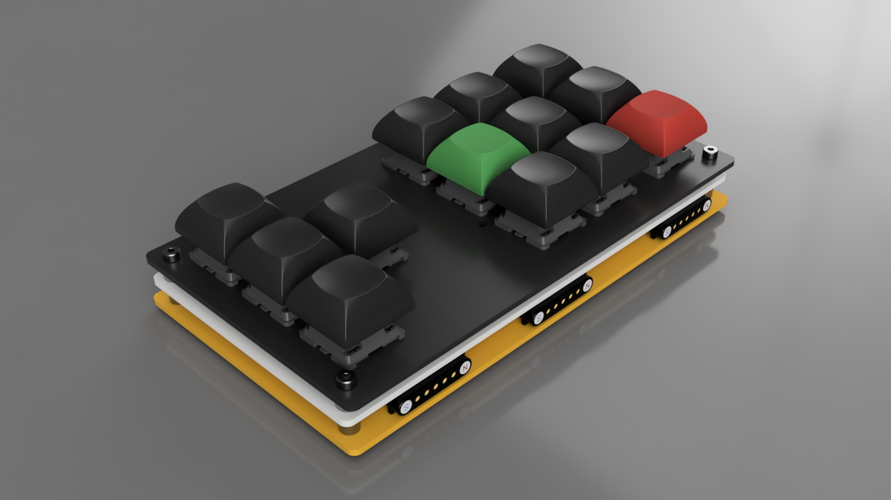

# Build Guide - PhaseShift

> **Note:** PhaseShift is an add-on block for the GlyphMatrix keyboard. It cannot function independently and must be connected to a GlyphMatrix for operation.

## Parts
### Required
| Part                | Quantity | Notes                         |
|---------------------|----------|-------------------------------|
| MX key switches     | 12       |                               |
| Hot swap sockets    | 12       |                               |
| Keycaps             | 12       |                               |
| M3x8mm screws       | 4        |                               |
| Spacers (3mm)       | 4        |                               |
| M3 gaskets (0.5mm)  | 4        |                               |
| M3x4mm screws       | 4        |                               |
| M3 Standoffs (5mm)  | 4        |                               |
| POGO Pin 5P (curved)| 1 Set    | For connection to GlyphMatrix |
| POGO Pin 7P (curved)| 2 Set    | For connection to GlyphMatrix |

### Optional
| Part                | Quantity | Notes                |
|---------------------|----------|----------------------|
| RGB LEDs            | 12       | SK6812 mini-e        |

## Steps

1. **Soldering Hot Swap Sockets and LEDs**
   - Solder all 12 hot swap sockets onto the PCB, aligning each socket with the footprint.
   - Install POGO pins for connection to GlyphMatrix, following the same alignment and soldering tips as in the GlyphMatrix guide.
   - (Optional) Solder per-key LEDs onto the PCB, ensuring correct orientation.

2. **Prepare Top Plate and Mounting Hardware**
   - Place the top plate onto the PCB.
   - Position the 4 spacers (3mm) at the mounting points.
   - Add M3 gaskets (0.5mm) between PCB and spacers.
   - Add 4 standoffs (5mm) at the bottom side of the PCB.
   - Insert 4 M3x8mm screws through the top plate, spacers, gaskets, and PCB, then loosely fasten with 5mm standoffs.
   - **Do not fully tighten yet.**

3. **Install Key Switches**
   - Carefully align each switch and press straight down into the socket. Check for bent pins.
   - Ensure all switches are fully seated and flush with the plate.

4. **Secure with Screws**
   - Place the bottom plate onto the stack.
   - Use 4 M3x4mm screws for any additional mounting points.
   - Tighten all screws evenly, but do not overtighten.

5. **Add Keycaps**
   - Press keycaps onto each switch stem.

6. **Final Check**
   - Inspect for fit and alignment.
   - Test for electrical contact after connecting to GlyphMatrix.

## Tips
- PhaseShift must be connected to a GlyphMatrix to function.
- Take your time with switch and socket installation for best results.

Enjoy your custom PhaseShift build!
