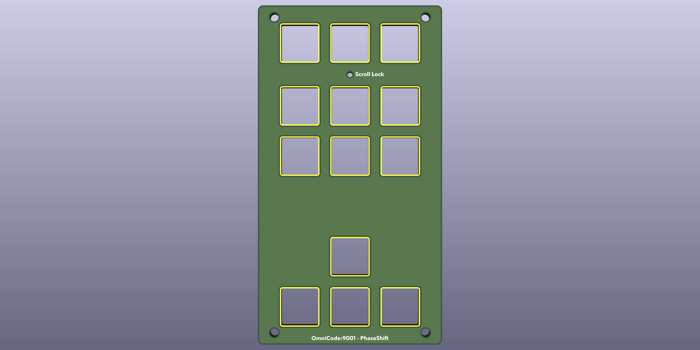
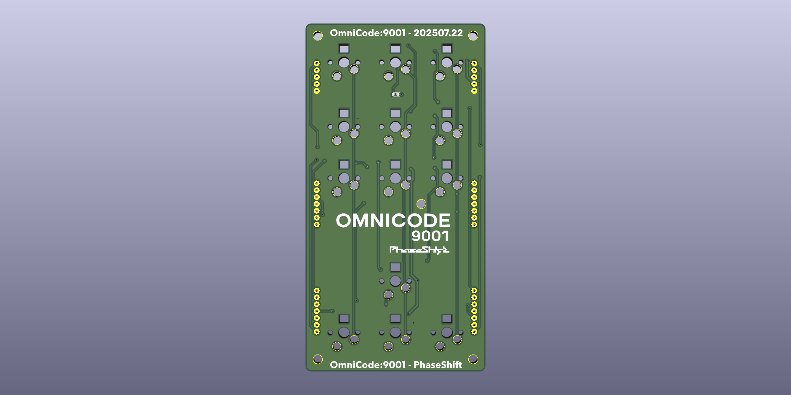
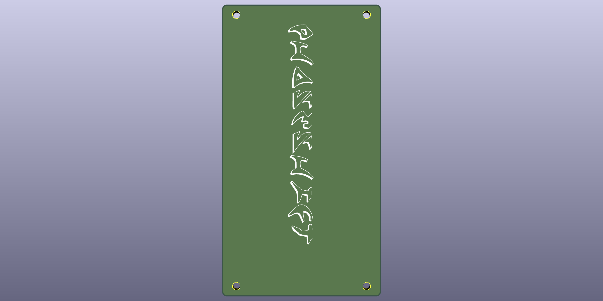
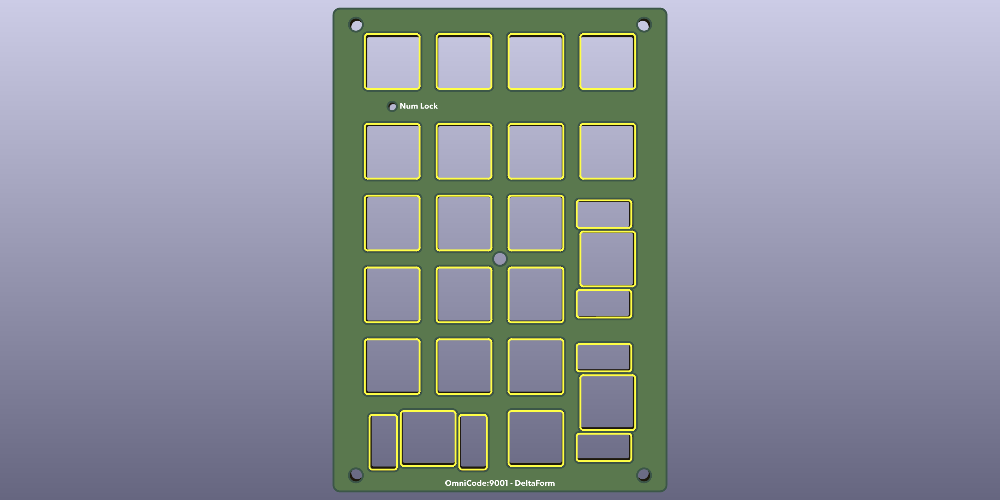
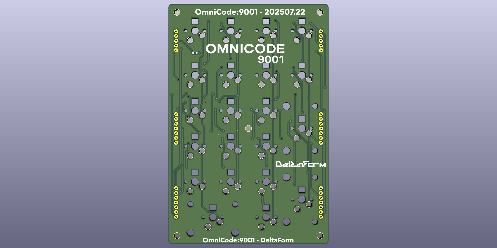
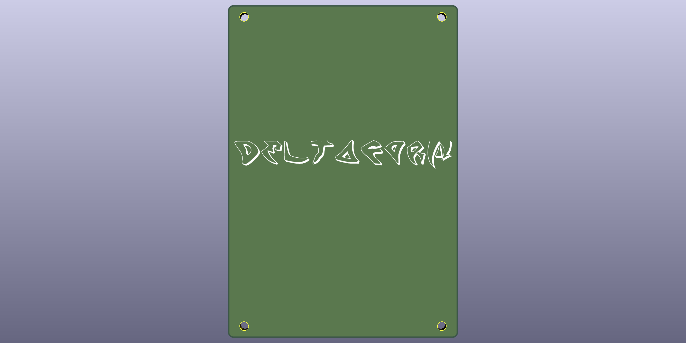

# OmniCode:9001 PCB Designs

This directory contains all KiCad PCB design files for the OmniCode:9001 keyboard modules.

## Modules

### GlyphMatrix (Alpha Block)
The main typing module with a full ANSI layout.

**Features:**
- RP2040 microcontroller
- USB Type-C connector
- Hot-swappable MX switch sockets
- RGB LED support
- POGO pin connections for modular attachment

### PhaseShift (Nav Block)
Navigation and macro control module.

**Features:**
- Hot-swappable MX switch sockets
- RGB LED support
- POGO pin connections for modular attachment

### DeltaForm (Num Block)
Numeric keypad and additional macro keys.

**Features:**
- Hot-swappable MX switch sockets
- RGB LED support
- POGO pin connections for modular attachment